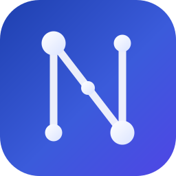

<div align="center">



# NexoraCLI

**Terminal client for [Nexora](https://github.com/ParendumOU/Nexora)** — chat with your
agents, watch tasks stream live, and manage sessions from the terminal. Go + Bubble Tea TUI.
Single static binary, zero runtime deps; connects to any Nexora / NexoraCloud instance over
the network (LAN, VPN, or public).


<video src="https://nexora.parendum.com/NexoraLandscape.mp4" controls muted loop playsinline width="720"></video>

**[🌐 Website](https://nexora.parendum.com) · [📖 Docs](https://docs.nexora.parendum.com) · [🧩 Marketplace](https://marketplace.nexora.parendum.com)**

</div>

> Status: **full frontend parity** — auth, streaming chat, agents CRUD, providers, knowledge
> bases, board/kanban, issues, schedules, marketplace, settings, and local tool execution on
> the CLI host. See the Roadmap below.

### Why use it?

- **🚀 One static binary, zero deps.** Drop `nexora` on your `PATH` — no Node, no Python, no Docker.
- **⌨️ The whole platform, in your terminal.** Everything the web UI does, keyboard-driven.
- **🖥️ Local tool execution.** Let agents run shell/file tools on *your* machine (opt-in, with consent prompts).
- **🔗 Connects to any instance** over LAN, VPN, or public — switch between many with `nexora instance use`.

## Install

Download a binary for your OS from the [latest release](https://github.com/ParendumOU/Nexora-CLI/releases/latest),
put it on your `PATH` as `nexora`, or build it yourself:

```bash
make build        # → bin/nexora (built inside the golang container; no host Go needed)
make build-all    # → dist/ for linux-amd64, darwin-arm64, windows-amd64
```

## Quick start

```bash
# Option A — email/password
nexora login --url https://nexora.example.com --name work

# Option B — pair from the web app (Settings → Devices → shows a code)
nexora pair --url https://nexora.example.com

# Option C — API key
nexora login --url https://nexora.example.com --api-key nxr_xxx

nexora                      # launch the TUI
nexora instance list       # list saved instances
nexora instance use work   # switch active instance
```

## Keybindings

| Key | Action |
|-----|--------|
| `tab` / `shift+tab` | switch screen (chat · agents · providers · kb · tasks · board · issues · schedules · sessions) |
| `ctrl+k` | command palette |
| `enter` | send / start a general chat (chat) · start chat (agents) · open chat (sessions) · open KB files (kb) |
| `/help` `/new` `/agent` `/model <name>` `/chain` `/copy` `/clearagent` | in-chat slash commands |
| `pgup`/`pgdn` · `ctrl+u`/`ctrl+d` · `ctrl+home`/`ctrl+end` | scroll the conversation |
| `ctrl+y` | copy the last assistant reply to the clipboard |
| `ctrl+p` | pick-a-message mode → `↑↓` move, `y`/enter copy that message, `esc` cancel |
| `/` | slash-command autocomplete popup → `↑↓` choose, `tab` complete, `enter` run, `esc` close |
| `ctrl+b` | toggle the lateral panel; `ctrl+o` cycles its panels (Sub-agents · Tasks · Usage) |
| `/usage` `/stats` | open the per-chat consumption panel (tokens · tools · routing · providers) |
| mouse drag | select text natively (no mouse capture) — then your terminal's copy (e.g. Ctrl+Shift+C) |
| `n` / `e` / `d` | new / edit / delete (agents, providers, kb, issues, schedules) |
| `u` / `i` | upload file / ingest URL (inside a knowledge base) |
| `←→ ↑↓` / `< >` | board: move cursor / move task between columns |
| `space` / `t` | schedules: toggle active / trigger now |
| `c` / `o` | issues: close / reopen |
| `r` | refresh (board, issues, schedules) |
| `/` | filter a list |
| `pgup`/`pgdn` | scroll transcript |
| `esc` | back / cancel overlay |
| `ctrl+c` | quit |

## Configuration

Stored at `<os-config-dir>/nexora/config.toml` (override with `NEXORA_CONFIG`):

```toml
current = "work"
[instances.work]
url = "https://nexora.example.com"
access_token = "…"   # auto-refreshed
refresh_token = "…"
api_key = ""         # optional nxr_ key; takes precedence if set
```

The file is written `0600` — it holds tokens. Never commit it (gitignored).

## How it connects

- REST: `<url>/api/*`, `Authorization: Bearer <jwt|nxr_key>`, transparent refresh on 401.
- Chat stream: WebSocket `<url>/ws/chat/{id}?token=…` — receives `chunk`/`tool_call`/`stream_end`
  frames plus live `task_created`/`task_updated` events.

## Roadmap (parity with the web frontend)

- **P1 (done):** connect, streaming chat, agent picker, sessions, tasks/plan.
- **P2 (done):** agents CRUD, providers (+ chains view), knowledge bases (create/files/upload/URL-ingest).
- **P3 (done):** board/kanban (move tasks between columns), issues (CRUD + close/reopen), schedules (create/toggle/trigger/delete).
- **P4 (done):** marketplace (browse/install/import-URL), settings (profile · orgs+switch · usage · devices · superuser backup export→download).

Full frontend parity reached. The React-Flow node-graph agent editor degrades to a form/list in the terminal.

## Development

No Go toolchain needed on the host — `make` runs everything in `golang:1.23`:

```bash
make tidy build vet test
```

## Contributing

Issues and PRs welcome — see [`CONTRIBUTING.md`](CONTRIBUTING.md) and
[`CODE_OF_CONDUCT.md`](CODE_OF_CONDUCT.md). Security reports: [`SECURITY.md`](SECURITY.md).

## License

[MIT](LICENSE) © Parendum OÜ

## ⭐ Found this useful?

Drop a star — it helps other terminal-dwellers find Nexora. New to the platform? Start at
**[nexora.parendum.com](https://nexora.parendum.com)**.

## Star history

<a href="https://www.star-history.com/?repos=ParendumOU%2FNexora-CLI&type=date&legend=top-left">
  <picture>
    <source media="(prefers-color-scheme: dark)" srcset="https://api.star-history.com/chart?repos=ParendumOU/Nexora-CLI&type=date&theme=dark&legend=top-left" />
    <source media="(prefers-color-scheme: light)" srcset="https://api.star-history.com/chart?repos=ParendumOU/Nexora-CLI&type=date&legend=top-left" />
    
  </picture>
</a>
